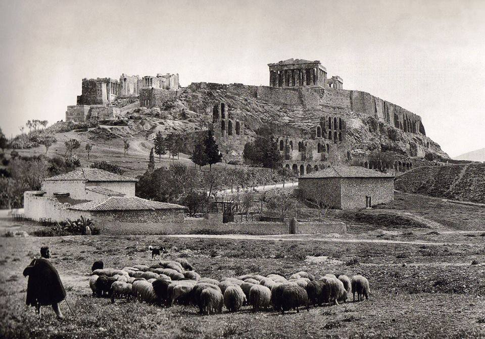

[ [Website](https://chris-kipp.io) | [Tooling Talks](https://tooling-talks.com) | [Mastodon](https://hachyderm.io/@ckipp) | [Twitter](https://twitter.com/ckipp01) | [Twitch](https://www.twitch.tv/ckipp) | [Sponsor](https://github.com/sponsors/ckipp01) ]

_SHEPHERD WITH HIS FLOCK ON THE ACROPOLIS IN 1903. PHOTOGRAPHER: FRED BOISSONNAS (KALLIMAGES COLLECTION, PARIS)_
